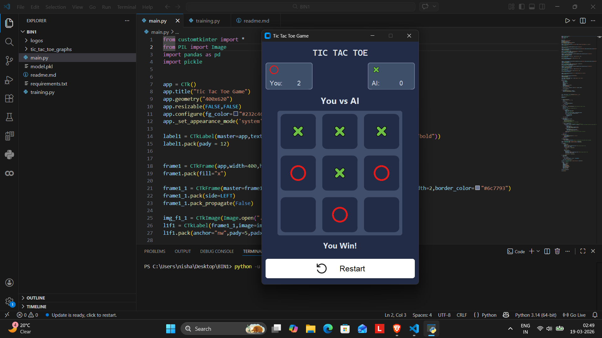

# 🎮 Tic Tac Toe AI (CustomTkinter)

A modern **Tic Tac Toe game with AI opponent** built using **Python, CustomTkinter, and Machine Learning**.

This project combines:

* 🎨 GUI development
* 🤖 AI prediction
* 📊 Data analysis & visualization

---

## 🚀 Features

* 🤖 AI opponent using trained ML model (`model.pkl`)
* 🎨 Modern UI with CustomTkinter
* ❌⭕ Image-based board (circle & cross icons)
* 🧠 Smart move selection using probability
* 🏆 Winner detection
* 📊 Score tracking (Player vs AI)
* 🔄 Reset functionality
* ✨ Smooth click animations

---

## 🖼️ Preview



---

## 📂 Project Structure

```
.
├── main.py                  # Main game UI
├── training.py              # Model training script
├── model.pkl                # Trained ML model
├── requirements.txt         # Dependencies
├── readme.md

├── logos/                   # UI assets
│   ├── circle.png
│   ├── cross.png
│   └── reset.png

├── tic_tac_toe_graphs/      # Data analysis visuals
│   ├── Board feature distribution.png
│   ├── Class Distribution.png
│   └── Feature Correlation Heatmap.png
```

---

## 🛠️ Tech Stack

* Python
* CustomTkinter
* Pillow (PIL)
* Pandas
* Scikit-learn

---

## ⚙️ Installation

1. Clone the repository:

```
git clone https://github.com/your-username/tic-tac-toe-ai.git
cd tic-tac-toe-ai
```

2. Install dependencies:

```
pip install -r requirements.txt
```

3. Run the game:

```
python main.py
```

---

## 🧠 How AI Works

* Board is converted to numeric format:

  * `X → 1`
  * `O → -1`
  * Empty → `0`
* Each possible move is evaluated
* Model predicts probability using `predict_proba`
* AI selects the move with **highest winning probability**

---

## 📊 Data Analysis

The project includes visualizations:

* Feature Distribution
* Class Distribution
* Correlation Heatmap

Located in:

```
tic_tac_toe_graphs/
```

---

## 🎯 Future Improvements

* 🟢 Highlight winning line
* 🎮 Difficulty levels
* 🔊 Sound effects
* 🌐 Web version (Streamlit)
* 📱 Mobile-friendly UI

---

## 👨‍💻 Author

**Nishant Rishi**


